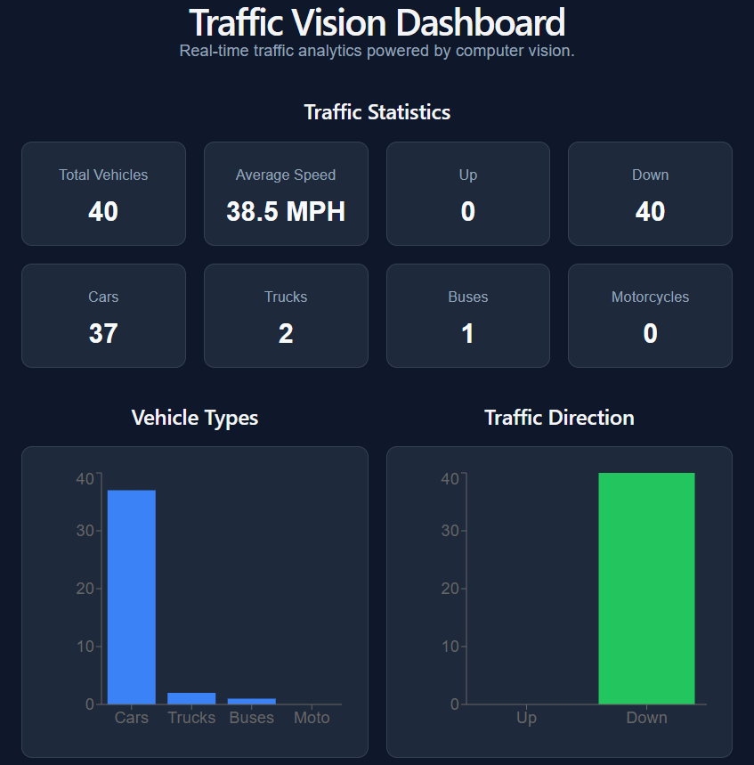

# Traffic Vision

Traffic Vision is a full-stack traffic analytics application that uses computer vision to detect and track vehicles from video footage, calculate travel time and estimated speed, store the results in PostgreSQL, and display live traffic analytics in a React dashboard.

The system uses YOLO and ByteTrack for vehicle detection and tracking, Python and OpenCV for video processing, PostgreSQL for persistent storage, Spring Boot for the REST API, and React for the frontend dashboard.

## Dashboard



## Features

- Detects and tracks cars, trucks, buses, and motorcycles
- Assigns persistent tracking IDs to vehicles
- Detects vehicle direction using line-crossing logic
- Calculates travel time between two detection lines
- Estimates vehicle speed in MPH
- Stores completed vehicle trips in PostgreSQL
- Exposes vehicle data through Spring Boot REST endpoints
- Displays live traffic statistics in React
- Automatically refreshes dashboard data every 3 seconds
- Shows vehicle-type and traffic-direction charts
- Displays the 10 most recent vehicle records
- Includes loading and backend connection error states

## Tech Stack

### Computer Vision
- Python
- OpenCV
- YOLO11
- ByteTrack

### Backend
- Java
- Spring Boot
- Spring Data JPA
- REST API

### Database
- PostgreSQL

### Frontend
- React
- Vite
- Recharts
- CSS

### Development Tools
- Git
- GitHub
- VS Code

## Architecture

Traffic Vision is split into three main parts:

1. **Computer Vision Pipeline**  
   Python processes video footage using YOLO for vehicle detection and ByteTrack for object tracking. Vehicles are monitored as they cross detection lines. The system calculates direction, travel time, and estimated speed before saving completed trips to PostgreSQL.

2. **Spring Boot Backend**  
   The backend reads vehicle records from PostgreSQL and exposes the data through REST API endpoints. It also calculates aggregate statistics such as total vehicles, average speed, vehicle counts, and direction counts.

3. **React Frontend**  
   The React dashboard requests data from the Spring Boot API every three seconds. It displays traffic statistics, vehicle-type and direction charts, and the most recent vehicle records.

### Data Flow

`Video → YOLO + ByteTrack → Python Processing → PostgreSQL → Spring Boot REST API → React Dashboard`

## API Endpoints

The Spring Boot backend provides REST endpoints for accessing traffic data.

### Get All Vehicles

`GET /api/vehicles`

Returns all vehicle records stored in PostgreSQL.

Each vehicle record includes information such as:

- Vehicle ID
- Vehicle type
- Direction
- Travel time
- Estimated speed

### Get Traffic Statistics

`GET /api/stats`

Returns aggregated traffic statistics used by the dashboard, including:

- Total vehicles
- Average vehicle speed
- Up direction count
- Down direction count
- Car count
- Truck count
- Bus count
- Motorcycle count

## Project Structure

```text
traffic-vision/
│
├── backend/
│   └── src/main/java/com/trafficvision/backend/
│       ├── TrafficStatsController.java
│       ├── Vehicle.java
│       ├── VehicleController.java
│       └── VehicleRepository.java
│
├── frontend/
│   ├── src/
│   │   ├── App.jsx
│   │   ├── App.css
│   │   └── main.jsx
│   └── package.json
│
├── vision/
│   └── detect.py
│
├── videos/
│
├── database.py
├── models.py
├── .gitignore
└── README.md

## Running the Project

Traffic Vision uses three separate components: the Spring Boot backend, the React frontend, and the Python computer vision pipeline.

### 1. Start the Backend

Navigate to the backend directory:

```bash
cd backend
```

Start the Spring Boot server:

```bash
./mvnw spring-boot:run
```

On Windows PowerShell:

```powershell
.\mvnw.cmd spring-boot:run
```

The backend runs on:

```text
http://localhost:8080
```

### 2. Start the Frontend

Open another terminal and navigate to the frontend directory:

```bash
cd frontend
```

Install dependencies:

```bash
npm install
```

Start the Vite development server:

```bash
npm run dev
```

The dashboard runs on:

```text
http://localhost:5173
```

### 3. Run the Computer Vision Pipeline

From the root `traffic-vision` directory, activate the Python virtual environment.

On Windows PowerShell:

```powershell
.\.venv\Scripts\Activate.ps1
```

Run the detector:

```bash
python -m vision.detect
```

Detected vehicle trips are saved to PostgreSQL. The Spring Boot API reads the stored data, and the React dashboard automatically refreshes every three seconds.

## Environment Configuration

Database credentials are stored in a local `.env` file and are not committed to GitHub.

Create a `.env` file in the project root and configure your PostgreSQL connection information before running the application.